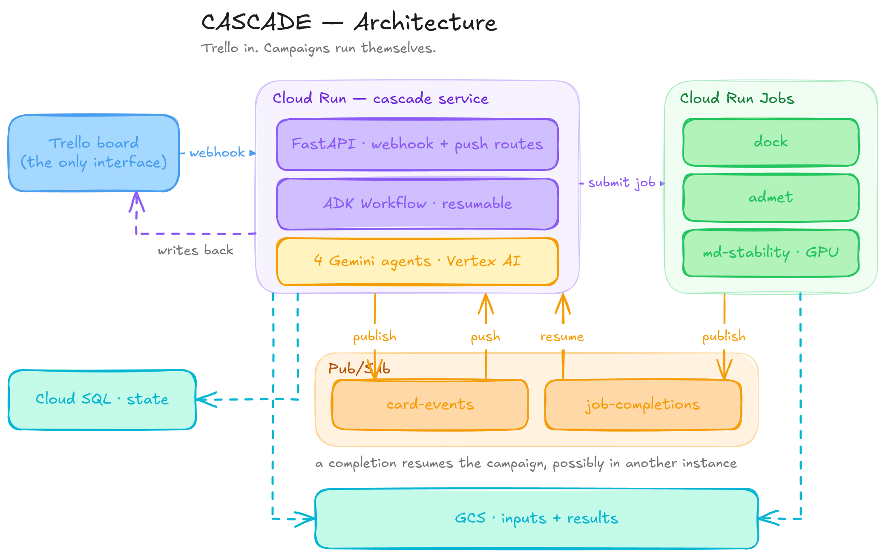
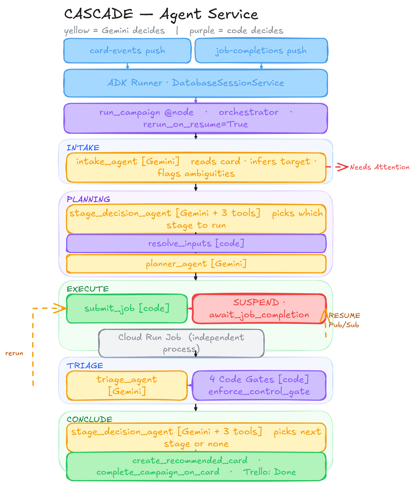

# CASCADE

**An autonomous computational chemistry coordinator that runs a drug-discovery screening funnel from a Trello board.**

A scientist drags a card into **To Do**. CASCADE reads it, decides which computational stage answers the question the card is asking, fetches the protein structure and the compound library, submits a containerised scientific workload to Cloud Run, judges the numbers that come back — including whether they can be trusted at all — writes the verdict onto the card, and proposes the next stage as a new card.

Built for the All Things Agentic Hackathon (Taskmaster track).

---

## What it does

A campaign starts when a Trello card enters **To Do**. A lightweight webhook validates and deduplicates the event, records it in Cloud SQL, and sends it to **Pub/Sub**.

The **ADK workflow** then interprets the card, resolves inputs into GCS, selects the appropriate computational stage, plans parameters, and launches a **Cloud Run Job**. Missing or ambiguous inputs move the card to **Needs Attention** instead of guessing.

The workflow then **suspends**, with its state checkpointed in Cloud SQL. Once the job finishes, results are stored in GCS and a completion event resumes the workflow in a new process.

The workflow evaluates the results and decides whether another stage is warranted. If so, a **Recommended** card is created with the surviving compounds and rationale; the original moves to **Done** with the results link.

**Trello is the human-readable narrative; Cloud SQL is the audit trail; Pub/Sub decouples execution; and ADK enables durable, resumable workflows.**

## The four scientific stages currently implemented

| Stage            | Question it answers                                                | Engine                                                     | Needs                                       | Produces                                                                                                   | Executor                                            |
| ---------------- | ------------------------------------------------------------------ | ---------------------------------------------------------- | ------------------------------------------- | ---------------------------------------------------------------------------------------------------------- | --------------------------------------------------- |
| `dock`         | Where does a compound sit in the pocket, and how well does it fit? | AutoDock Vina 1.2.7 + RDKit + Meeko + Open Babel + gemmi   | protein structure, ligand structures        | `scores.csv`, `poses.sdf`, best-pose PDBQT files, `reference_ligand.pdb`, score-reliability analysis | Cloud Run Job, 8 vCPU                               |
| `admet`        | Does the compound carry known developability liabilities?          | RDKit descriptors + PAINS/BRENK/NIH alert catalogues       | ligand structures only                      | `assessments.csv`, per-compound pass/flag/fail with named liabilities                                    | Cloud Run Job, 2 vCPU                               |
| `md_stability` | Does a docked pose actually persist, or is it an artifact?         | OpenMM 8.3 + AMBER14 + GBn2 implicit solvent + OpenFF/GAFF | protein structure,**posed complexes** | `stability.csv`, per-compound RMSD series, stable/drifted/unstable verdicts                              | Cloud Run Job,**NVIDIA L4**, `europe-west1` |

Similar kind of worklows can be easily added

---

## Architecture

One FastAPI service on Cloud Run. Trello is the human interface. Pub/Sub decouples webhook acknowledgement from agent work. Google ADK's resumable graph workflow holds campaign state. Cloud Run Jobs run the science. Cloud SQL stores state; GCS stores artifacts.



### Inside the agent service

Yellow is where Gemini decides; purple is where code decides. The split is deliberate — every scientific threshold and gate is enforced in code that the model cannot talk its way past.



### Repository layout

```
src/cascade/
  main.py            FastAPI app, lifespan, request-id middleware, router registration
  config.py          pydantic-settings Settings, @lru_cache get_settings()
  db.py              async engine, sessionmaker, get_db(), ADK-table exclusion helper
  dependencies.py    Annotated DI aliases: SettingsDep, DbDep, RunnerDep
  models.py          5 SQLAlchemy 2.0 ORM models
  schemas.py         JobSpec / TargetStructure / BindingSite — the service↔container contract
  security.py        Pub/Sub push OIDC verification
  observability.py   Cloud Logging JSON formatter
  routes/            HTTP only — no business logic
  agents/
    schemas.py         every Pydantic model passed between nodes
    capabilities.py    stage requirement/production matrix
    definitions.py     4 Gemini Agents
    prompts.py         all instruction strings
    nodes.py           @node workflow steps (Trello I/O, submission, records, escalations)
    campaign.py        the orchestrator node + Workflow graph
    policy.py          every code-enforced rule and gate
    input_resolution.py  where a stage's inputs come from
    compound_library.py  SMILES/SDF parsing, subsetting, 3D detection
    card_text.py       everything CASCADE writes onto the board, in one module
    decision_tools.py  the three read-only agent tools
    persistence.py     run/job/decision/artifact reads and writes
    runtime.py         Runner construction, session lookup, idempotency, resume
    app.py             App(root_agent=…, ResumabilityConfig(is_resumable=True))
  clients/           Trello · GCS · Pub/Sub · Cloud Run Jobs · structure resolver
workloads/           dock/ · admet/ · md_stability/ · cofold/  — standalone images
terraform/           the entire GCP footprint
migrations/          Alembic
tests/               16 modules, 312 tests
examples/            hiv-protease-1hsg end-to-end scenario
```

Routes handle HTTP. Agents handle intelligence. Clients handle external APIs. Nothing crosses over.

## Technology stack

### Model

|           |                                                      |
| --------- | ---------------------------------------------------- |
| Model     | **Gemini 3.7 Flash** — `gemini-3.7-flash`   |
| Served by | Vertex AI (`enterprise=True`, location `global`) |

### Service

| Component         | Technology                                          | Version                           |
| ----------------- | --------------------------------------------------- | --------------------------------- |
| Language          | Python                                              | 3.12+ (developed on 3.13.5)       |
| Package manager   | uv                                                  | `uv.lock` committed             |
| Agent framework   | Google ADK —`google-adk[db]`                     | 2.7.1 (pinned`>=2.7,<2.8`)      |
| Gemini SDK        | google-genai                                        | 2.18.1                            |
| Web framework     | FastAPI                                             | 0.141.1                           |
| ASGI server       | uvicorn                                             | 0.52.1                            |
| Validation        | Pydantic                                            | 2.13.4                            |
| Configuration     | pydantic-settings                                   | 2.15.0                            |
| ORM               | SQLAlchemy (async)                                  | 2.0.52                            |
| DB driver         | asyncpg                                             | 0.31.0                            |
| Migrations        | Alembic                                             | 1.19.1                            |
| Database          | PostgreSQL (Cloud SQL)                              | 16                                |
| HTTP client       | httpx                                               | 0.28.1                            |
| Google Cloud SDKs | google-cloud-storage / -pubsub / -run / google-auth | 3.13.1 / 2.39.1 / 0.16.1 / 2.56.3 |
| Tests             | pytest / pytest-asyncio                             | 9.1.1 / 1.4.0                     |
| Lint & format     | ruff                                                | 0.16.2                            |
| IaC               | Terraform /`hashicorp/google`                     | ≥ 1.7 / 6.50.0                   |

### Google Cloud services

Cloud Run (service + jobs) · Cloud SQL · Pub/Sub · Cloud Storage · Secret Manager · Artifact Registry · Cloud Build · Vertex AI · IAM

### Scientific stack, per workload container

| Container        | Technology                 | Version                     |
| ---------------- | -------------------------- | --------------------------- |
| `dock`         | AutoDock Vina              | 1.2.7                       |
|                  | RDKit                      | 2026.3.5                    |
|                  | Meeko                      | 0.7.1                       |
|                  | Open Babel                 | Debian`openbabel` package |
|                  | gemmi                      | 0.7.5                       |
|                  | NumPy / SciPy              | 2.5.2 / 1.18.0              |
| `admet`        | RDKit                      | 2026.3.5                    |
| `md_stability` | OpenMM                     | 8.3                         |
|                  | openmmforcefields          | 0.15                        |
|                  | AmberTools                 | 24                          |
|                  | OpenFF Toolkit · PDBFixer | unpinned (conda-forge)      |
|                  | CUDA                       | 12.6                        |
| `cofold`       | Protenix                   | 2.0.0                       |
|                  | PyTorch                    | 2.7.1                       |
|                  | CUDA / cuDNN               | 12.6 / 9                    |

---

---

## Getting started (local)

### Prerequisites

- Python 3.12+
- [`uv`](https://docs.astral.sh/uv/)
- Docker + Docker Compose (for the local PostgreSQL)
- A Google Cloud project with Vertex AI enabled, if you want the agents to actually call Gemini
- `gcloud` CLI

### 1. Install

```bash
git clone <this repo>
cd cascade
uv sync
```

### 2. Start PostgreSQL

```bash
docker compose up -d db          # postgres:16-alpine on localhost:5432, user/pass/db = cascade
```

### 3. Configure

```bash
cp .env.example .env
```

Fill in at minimum `CASCADE_GCP_PROJECT_ID`, `CASCADE_GCS_BUCKET`, and the five `CASCADE_TRELLO_*` values. Every setting is documented in [Configuration reference](#configuration-reference). Placeholders are fine for anything you are not exercising — the tests never read `.env`.

### 4. Authenticate to Google Cloud

```bash
gcloud auth login
gcloud auth application-default login
gcloud config set project <your-project-id>
```

ADC is the only credential path; there are no service-account key files anywhere in this project.

### 5. Migrate and run

```bash
uv run alembic upgrade head
uv run uvicorn cascade.main:app --reload --port 8000
```

```bash
curl -s localhost:8000/health          # {"status":"ok"}
```

Interactive API docs are at `http://localhost:8000/docs`.

> Local runs use `DatabaseSessionService` against the compose Postgres. For agent unit tests, use `InMemorySessionService` — never the database service.

### 6. Exercise it without Trello

Trello cannot call `localhost`. Either expose the port with a tunnel (`cloudflared tunnel --url http://localhost:8000`, or ngrok) and register the webhook against that URL, or deploy to Cloud Run and drive it from the real board. The `/pubsub/*` endpoints require a valid Google-signed OIDC token, so they cannot be curl'd by hand.

---

## Deploying to Google Cloud

Terraform stands up the entire footprint: Cloud Run service, three Cloud Run Jobs, Cloud SQL, GCS bucket, two Pub/Sub topics with OIDC push subscriptions, Secret Manager entries, two Artifact Registry repos, four service accounts, and every IAM binding.

### First-time infra

```bash
gcloud auth login
gcloud auth application-default login

# 1. Fill in terraform/terraform.tfvars: project_id, region, trello_* values,
#    and the three *_image_digest variables. Leave `image` at its default —
#    the placeholder image stands up all infra on the first apply.
cd terraform
terraform init
terraform validate
terraform plan -out=cascade.tfplan
terraform apply cascade.tfplan

# 2. Build and push the service image
cd ..
gcloud builds submit --tag <REGION>-docker.pkg.dev/<PROJECT>/cascade/cascade:latest .

# 3. Point Cloud Run at the real image: set `image` in terraform.tfvars, then
cd terraform
terraform plan -out=cascade.tfplan
terraform apply cascade.tfplan
```

### Building the workload images

Each workload is its own image, pinned in Terraform **by digest** (not by tag).

```bash
cd workloads/dock
gcloud builds submit --tag <REGION>-docker.pkg.dev/<PROJECT>/cascade/dock:v1 .
gcloud artifacts docker images describe \
  <REGION>-docker.pkg.dev/<PROJECT>/cascade/dock:v1 --format="value(image_summary.digest)"
# put that digest in terraform/terraform.tfvars as dock_image_digest, then re-apply
```

Same pattern for `admet` (`admet_image_digest`) and `md_stability` (`md_stability_image_digest`).

### The GPU job (`md_stability`, `europe-west1`)

`cascade-md-stability` is the one job that does **not** live in the primary region. The project's NVIDIA L4 quota (`nvidia_l4_gpu_allocation_no_zonal_redundancy`, effective limit **1**) was granted in `europe-west1` only — so the job, its Artifact Registry repo, and its image all live there, `gpu_zonal_redundancy_disabled = true`, and `parallelism` is capped at 1.

Order matters on the first apply, because Cloud Run validates the image at job-creation time:

```bash
cd terraform
terraform apply -target=google_artifact_registry_repository.cascade_gpu   # 1. repo first

cd ../workloads/md_stability                                             # 2. then the image
gcloud builds submit --tag europe-west1-docker.pkg.dev/<PROJECT>/cascade/md-stability:v1 .

cd ../../terraform                                                       # 3. then the job
terraform plan -out=gpu.tfplan && terraform apply gpu.tfplan
```

Confirm the GPU actually attached:

```bash
gcloud run jobs describe cascade-md-stability --region europe-west1 \
  --format="value(spec.template.spec.template.spec.nodeSelector)"
```

The container logs `simulating on the CUDA platform` when the GPU is live. Without a driver it warns per platform and falls back to OpenCL, then CPU — the run still completes, just slower, and `platform` in `results.json` records which one actually ran.

## Setting up the Trello board

1. Create a board with exactly five lists: **To Do**, **In Progress**, **Recommended**, **Needs Attention**, **Done**.
2. Get an API key and token from [https://trello.com/power-ups/admin](https://trello.com/power-ups/admin) — create a Power-Up, then generate the key and authorise a token. The **OAuth secret** on that same admin page is the HMAC key for webhook verification (`CASCADE_TRELLO_API_SECRET`); it is neither the key nor the token.
3. Collect the board id and the five list ids:
   ```bash
   curl -s "https://api.trello.com/1/boards/<BOARD>/lists?key=$KEY&token=$TOKEN" \
     | python3 -c 'import json,sys; [print(l["id"], l["name"]) for l in json.load(sys.stdin)]'
   ```
4. Put the board id, the five list ids, and the three credentials into `terraform.tfvars` (or `.env` locally). Terraform pushes the credentials into Secret Manager and the ids into plain Cloud Run env vars, and derives `CASCADE_TRELLO_CALLBACK_URL` from the service URL.
5. Register the webhook against the deployed service:
   ```bash
   curl -X POST "https://api.trello.com/1/webhooks" \
     -H 'Authorization: OAuth oauth_consumer_key="'"$KEY"'", oauth_token="'"$TOKEN"'"' \
     -H "Content-Type: application/json" \
     -d '{"idModel":"<BOARD_ID>","callbackURL":"https://<service-url>/webhooks/trello","description":"cascade"}'
   ```

   Trello verifies the endpoint with a `HEAD` request first; the service implements `HEAD /webhooks/trello` for exactly that.

---

## Configuration reference

All settings use the `CASCADE_` prefix and are read once via `@lru_cache`. Required settings have no default.

| Setting                                                                                       | Default              | Notes                                                                                                              |
| --------------------------------------------------------------------------------------------- | -------------------- | ------------------------------------------------------------------------------------------------------------------ |
| `DATABASE_URL`                                                                              | —                   | `postgresql+asyncpg://…`. In production, Cloud SQL over a unix socket via `?host=/cloudsql/<connection-name>` |
| `GCP_PROJECT_ID`                                                                            | —                   |                                                                                                                    |
| `GCP_REGION`                                                                                | `us-central1`      | service, Cloud SQL, GCS, dock + admet jobs                                                                         |
| `GCP_GPU_REGION`                                                                            | `europe-west1`     | where the L4 quota lives;`md_stability` deploys here                                                             |
| `GCS_BUCKET`                                                                                | —                   | artifact bucket                                                                                                    |
| `PUBSUB_PUSH_SERVICE_ACCOUNT`                                                               | —                   | the identity push tokens must claim                                                                                |
| `PUBSUB_PUSH_AUDIENCE`                                                                      | —                   | service base URL; the request path is appended when verifying                                                      |
| `PUBSUB_CARD_EVENTS_TOPIC`                                                                  | `card-events`      | the completions topic is*not* a setting — containers read `PUBSUB_TOPIC` from the job definition              |
| `TRELLO_API_KEY` / `_TOKEN` / `_SECRET`                                                 | —                   | secrets;`_SECRET` is the Power-Up OAuth secret used for HMAC                                                     |
| `TRELLO_BOARD_ID`, `TRELLO_CALLBACK_URL`                                                  | —                   | callback URL is part of the HMAC payload, so it must match exactly                                                 |
| `TRELLO_LIST_TODO` / `_IN_PROGRESS` / `_RECOMMENDED` / `_NEEDS_ATTENTION` / `_DONE` | —                   |                                                                                                                    |
| `GEMINI_MODEL`                                                                              | `gemini-3.7-flash` | never hardcoded in agent definitions                                                                               |
| `GEMINI_LOCATION`                                                                           | `global`           | Vertex AI location                                                                                                 |
| `ADK_USER_ID`                                                                               | `cascade`          |                                                                                                                    |
| `MAX_LLM_CALLS_PER_INVOCATION`                                                              | `60`               | the enforced per-run cost ceiling                                                                                  |
| `MAX_LIGANDS_PER_CLOUD_RUN_JOB`                                                             | `50`               | above this, routing goes to Cloud Batch (not implemented)                                                          |
| `RESULTS_LINK_EXPIRY_MINUTES`                                                               | `10080`            | 7 days — the V4 signed-URL maximum                                                                                |
| `CONTROL_RMSD_THRESHOLD_ANGSTROM`                                                           | `2.0`              | the control gate threshold                                                                                         |
| `CONTROL_RERUN_CONFORMERS_PER_LIGAND`                                                       | `8`                | the code-fixed escalation after a control failure                                                                  |
| `MAX_JOB_ATTEMPTS`                                                                          | `2`                |                                                                                                                    |
| `MAX_MODEL_REFLECT_RETRIES`                                                                 | `2`                | ADK`ReflectAndRetryModelPlugin`                                                                                  |
| `MAX_STAGE_DECISION_ATTEMPTS`                                                               | `2`                | reject-and-retry budget for an unrunnable stage choice                                                             |

Every scientific threshold that matters is configuration, not a magic number buried in a prompt.

---

## Running the end-to-end example

`examples/hiv-protease-1hsg/` exercises the whole pipeline, including the branch the system is really judged on: **the agent catching its own bad run, fixing it, and confirming the fix.**

1. Create a card in **To Do** titled `Screen 10 compounds against HIV-1 protease`.
2. Either attach `compounds.smi`, or paste `card-description.md` as the description (not both — the attachment path is the realistic one, the description path exercises SMILES-in-text parsing).
3. If you attached the file, the description still has to name the target and the control:
   ```
   Screen the attached compounds against HIV-1 protease, PDB 1HSG.
   Use indinavir as the control compound.
   ```

Indinavir is the co-crystallised ligand of 1HSG, so its true binding pose is known experimentally — which makes it a control the pipeline can be *graded* against rather than a compound it merely scores.

| Stage           | Expected                                                                                                                               |
| --------------- | -------------------------------------------------------------------------------------------------------------------------------------- |
| Intake          | Comments its reading: target 1HSG via`rcsb`, 10 compounds, control `indinavir`. Card → **In Progress**.                     |
| Planner         | Picks`conformers_per_ligand` and leaves the binding site to the co-crystal ligand; its choices and reasoning are posted on the card. |
| Dock, attempt 1 | Control's top-pose RMSD lands above the 2.0 Å threshold.                                                                              |
| Control gate    | Comments**"Control compound check failed"** and resubmits with `conformers_per_ligand = 8` as attempt 2 — enforced in code.   |
| Dock, attempt 2 | Control's best-mode RMSD comes back under 2.0 Å.                                                                                      |
| Triage          | A verdict per compound, plus whether the ranking can be trusted at all.                                                                |
| Proposer        | Creates a**Recommended** card carrying only the survivors, with a rationale and a cost estimate.                                 |
| Done            | Original card →**Done**, with results link and the full comment chain.                                                          |

Drag the Recommended card to **To Do** to run ADMET on the narrowed set, and the card *that* stage proposes to run `md_stability` on what survives. Across the chain: `dock` 10 → ~5–9 · `admet` → ~4 · `md_stability` → ~4. ADMET does the hard narrowing, on real published liabilities (ritonavir and montelukast and atorvastatin fail on Lipinski violations; nelfinavir on hERG risk).

Verify the audit trail:

```bash
RUN_ID=$(psql "$DATABASE_URL" -tAc "select id from runs where trello_card_id = '<card-id>'")

psql "$DATABASE_URL" -c "select agent, decision_kind, left(rationale,80) from decisions
                         where run_id = '$RUN_ID' order by created_at"
psql "$DATABASE_URL" -c "select attempt, state, exit_code from jobs
                         where run_id = '$RUN_ID' order by attempt"
```

Expect at least three `decisions` rows (`dock_plan`, `dock_triage`, `dock_followup`) and two `jobs` rows for the same run.

---
